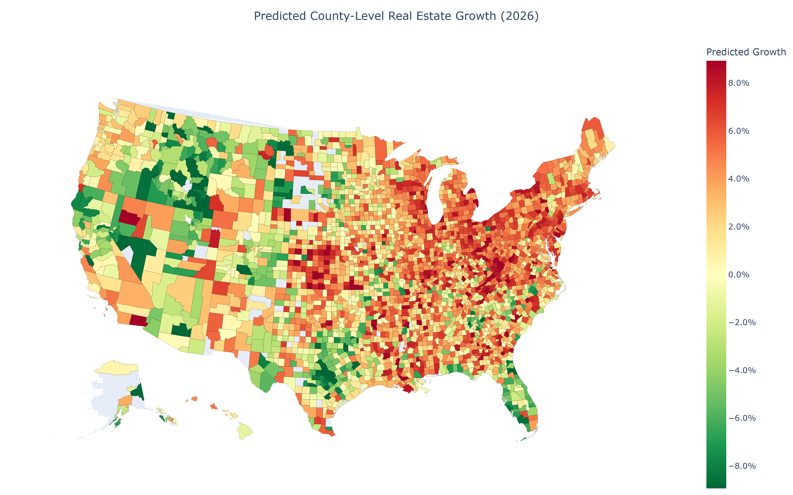
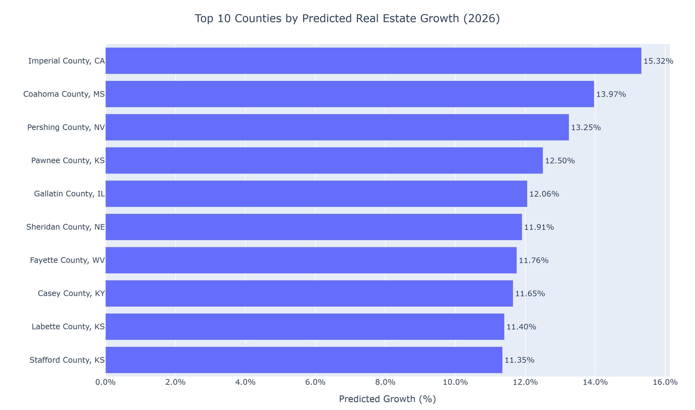
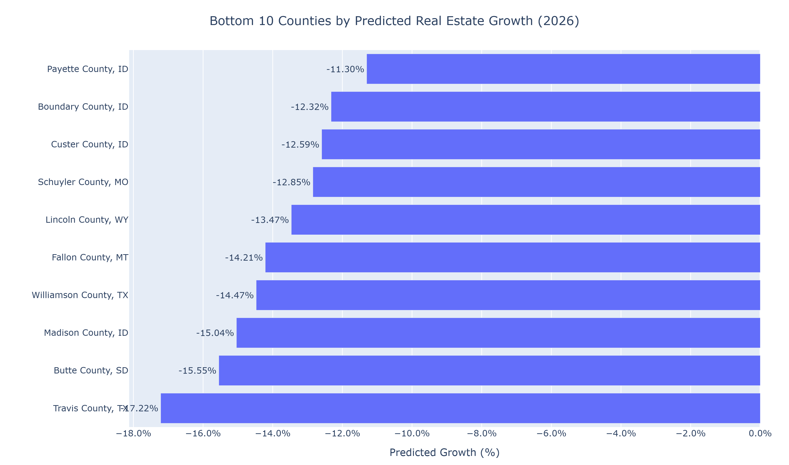
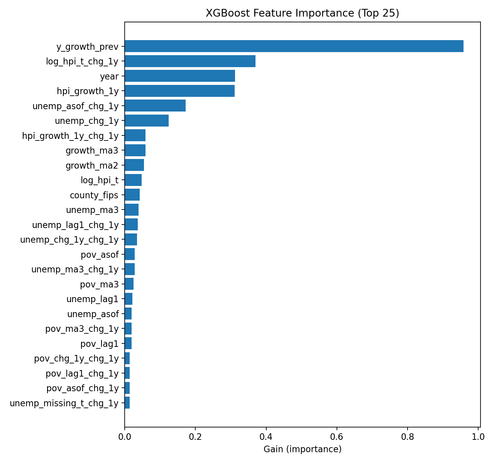

# real-estate-growth-ml
Machine learning model predicting county-level real estate growth in the U.S. through 2026 using housing, employment, crime, and demographic features.

# County-Level Real Estate Growth Forecast (2026)

## Project Overview
This project builds a machine learning model to forecast county-level real estate growth in the United States through 2026.  
Using historical housing, employment, crime, and demographic data, I trained and compared multiple regression models, ultimately selecting **XGBoost** for its strong predictive performance.  

The goal is to highlight which regions are expected to grow fastest (and slowest), providing insight for investors, policymakers, and researchers.

---

## Key Results

### Predicted Growth Map (2026)
  
*Interactive version available [here](https://wesley-hawes.github.io/real-estate-growth-ml/01_growth_2026_interactive_map.html).*

### Top 10 Counties by Predicted Growth


### Bottom 10 Counties by Predicted Growth


### Feature Importance


---

## Artifacts

The following files summarize the key outputs of this project. They are stored in the `/artifacts/` folder.

### 1. Growth Maps
- **01_growth_2026_interactive_map.html** → Interactive county-level choropleth (open in a browser)
- **02_growth_2026_map.png** → Static county-level choropleth (for README/LinkedIn)

### 2. Ranking Charts
- **03_top10_bar_2026.png** → Top 10 counties by predicted growth
- **04_bottom10_bar_2026.png** → Bottom 10 counties by predicted growth

### 3. Feature Importance and Explainability
- **05_feature_importance_topN.png** → Visualization of top model features
- **06_feature_importance_full.xlsx** → Full ranked list of features
- **07_feature_importance_bar.png** → Bar chart view of feature importance
- **08_feature_importance_beeswarm.png** → SHAP beeswarm plot (model interpretability)

### 4. Model Artifact
- **09_xgb_model.json** → Saved trained XGBoost model for reproducibility

---

## Methods
- **Data Engineering:** Merged housing (Zillow), employment (BLS), crime (FBI/Uniform Crime Reporting), and demographics (Census) at the county-year level (2002–2024).  
- **Feature Engineering:** Created lag variables, growth rates, and moving averages to capture temporal and structural patterns. Examples of predictors:
  - Employment change  
  - Population size and growth  
  - Crime rates  
  - Housing affordability  
  - Migration indicators  
- **Modeling Approach:**
  - Tested **Ridge Regression**, **Random Forests**, and **XGBoost**.  
  - **Ridge Regression** struggled with non-linear effects.  
  - **Random Forest** improved accuracy but lacked scalability for interpretation.  
  - **XGBoost** achieved the best overall performance (lowest RMSE, MAPE), and was selected for final predictions.  
- **Evaluation:** Metrics included RMSE, R², and MAPE.  
- **Explainability:** Feature importance plots and SHAP values to interpret model predictions.  
- **Visualization:** Interactive U.S. county maps and ranking charts with Plotly.

---

## Insights
- High growth counties cluster in Southeast and Mountain West.  
- Declining counties are concentrated in Midwest and Rust Belt.  
- Top predictors included housing affordability, employment change, crime rates, and migration trends.  
- XGBoost outperformed linear and tree-based baselines, demonstrating the value of non-linear boosting methods in real estate forecasting.  

---

## How to Reproduce
1. Clone the repo  
   ```bash
   git clone https://github.com/yourusername/real-estate-forecast.git
   cd real-estate-forecast

